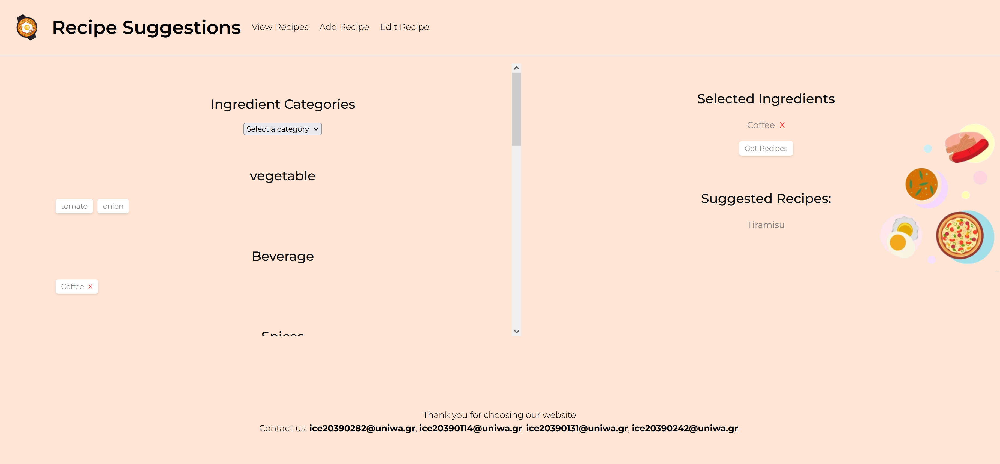
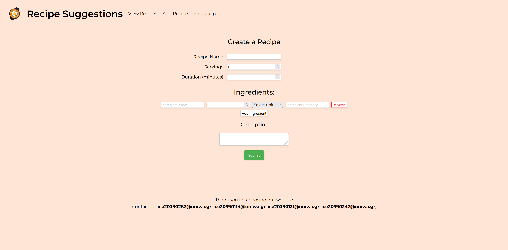
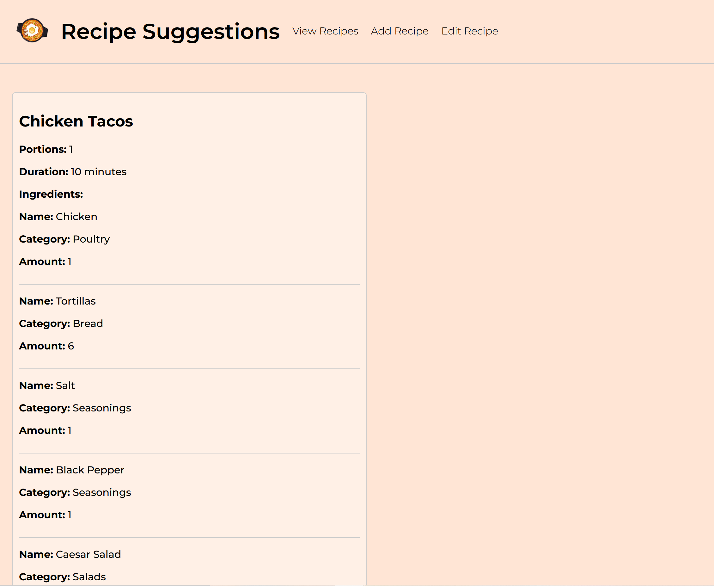

# Recipe Suggestions Project

A full-stack web application for managing recipes and getting recipe suggestions based on available ingredients. Built with ASP.NET Core and Vue.js ,created collaboratively as part of Special Topics in Software Engineering class.

##  Features

- **Recipe Management**
  - Create, read, update, and delete recipes
  - Add ingredients with quantities and units
  - Specify cooking duration and servings
  
- **Ingredient Management**
  - Manage ingredients database
  - Categorize ingredients by type
  
- **Recipe Suggestions**
  - Get recipe recommendations based on available ingredients
  - Smart matching algorithm

## 🛠 Tech Stack

### Backend
- **Framework**: ASP.NET Core 
- **Database**: PostgreSQL with Entity Framework Core
- **ORM**: Entity Framework 
- **API Documentation**: Swagger/OpenAPI

### Frontend
- **Framework**: Vue.js 
- **Build Tool**: Vite
- **Routing**: Vue Router
- **HTTP Client**: Fetch API

### Database Providers Supported
- PostgreSQL (Primary)
- SQL Server
- In-Memory (For testing)

---
## Screenshots

### Home Page

### Add Recipe

### View Recipes

### Edit Recipes

---

## 📄 License

This project is licensed under the MIT License - see the [LICENSE.txt](LICENSE.txt) file for details.

## 👥 Authors

- **Evangelos Spyropoulos**
- **Chen JinFei**
- **Marilena Kosma**
- **Theofania Livanidi**

Copyright © 2023-2024
