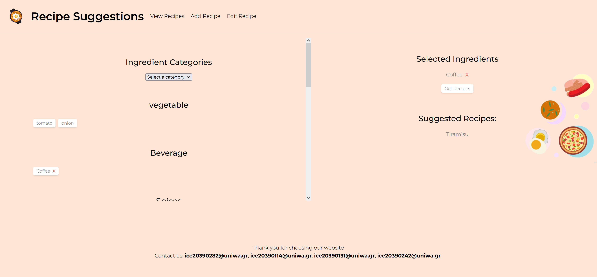
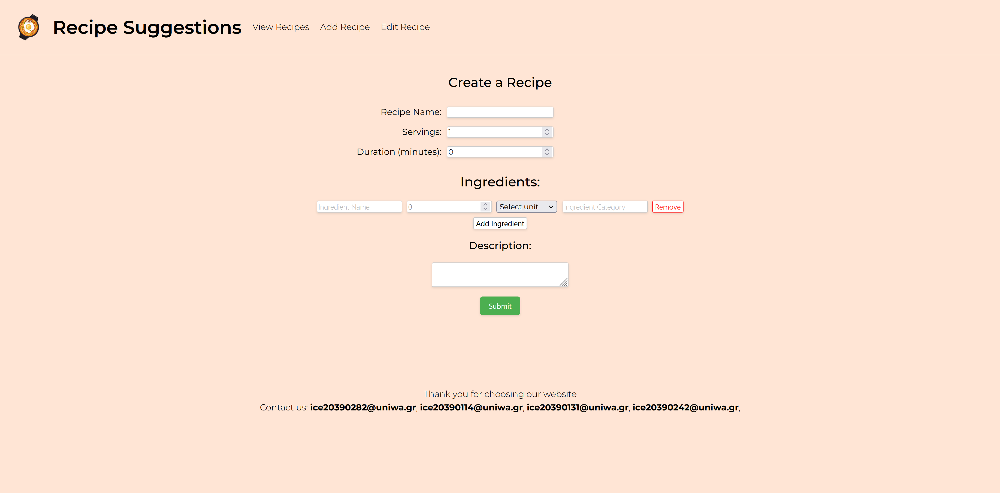
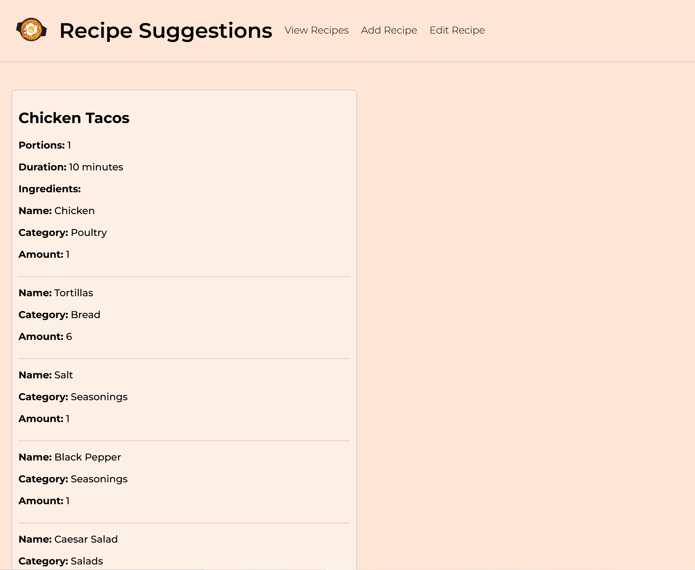
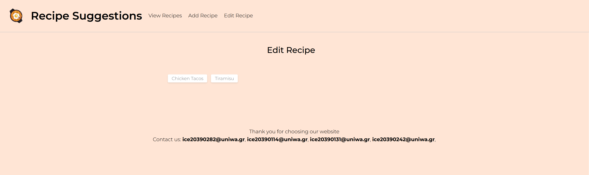

# Recipe Suggestions Project

A full-stack web application for managing recipes and getting recipe suggestions based on available ingredients. Built with ASP.NET Core and Vue.js,created collaboratively as part of "Special Topics in Software Engineering" class.

## 👥 Authors

- **Evangelos Spyropoulos**
- **Chen JinFei**
- **Marilena Kosma**
- **Theofania Livanidi**

Copyright © 2023-2024

##  Features

- **Recipe Management**
  - Create, read, update, and delete recipes
  - Add ingredients with quantities and units
  - Specify cooking duration and servings
  
- **Ingredient Management**
  - Manage ingredients database
  - Categorize ingredients by type
  
- **Recipe Suggestions**
  - Get recipe recommendations based on available ingredients
  - Smart matching algorithm

## 🛠 Tech Stack

- **Frontend**: Vue.js 
- **Backend**: ASP.NET Core 
- **Database**: PostgreSQL with Entity Framework Core
- **ORM**: Entity Framework 
- **API Documentation**: Swagger/OpenAPI
---
## Screenshots

### Home Page

### Add Recipe

### View Recipes

### Edit Recipes

---

## 📄 License

This project is licensed under the MIT License - see the [LICENSE.txt](LICENSE.txt) file for details.

